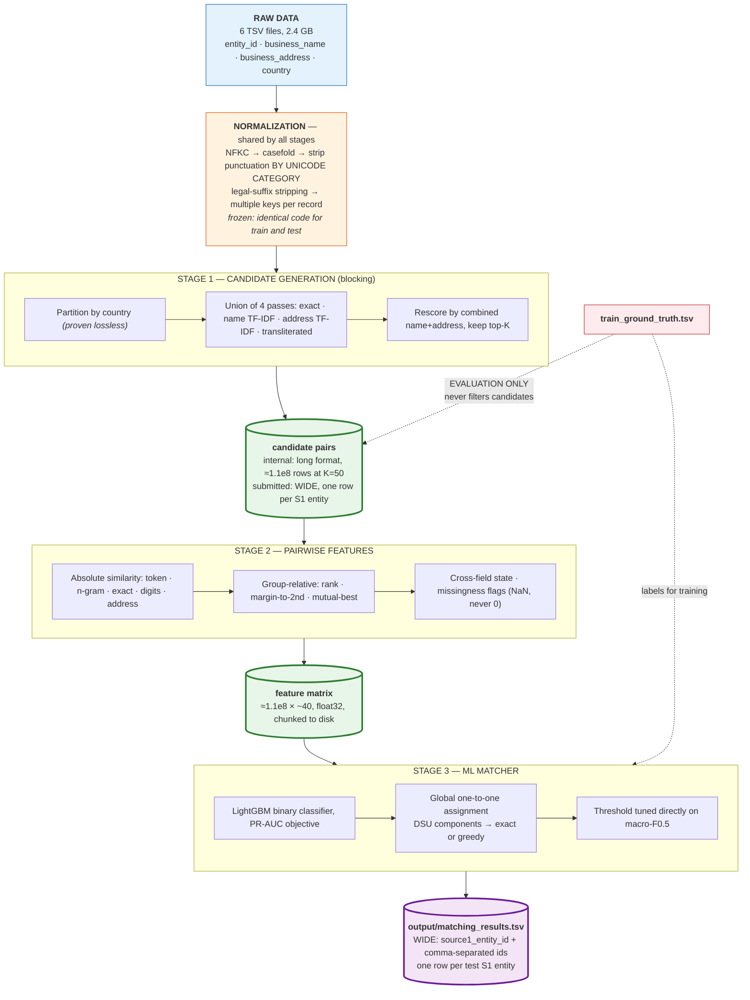
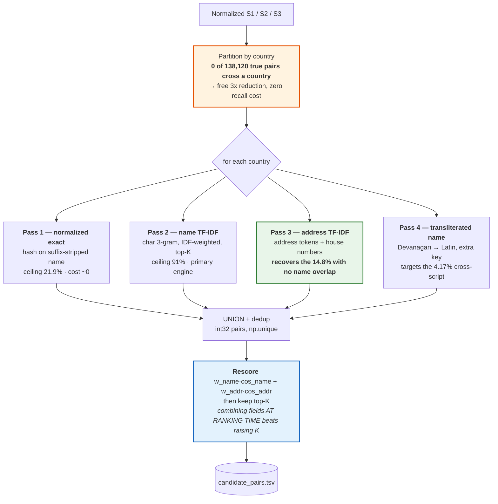
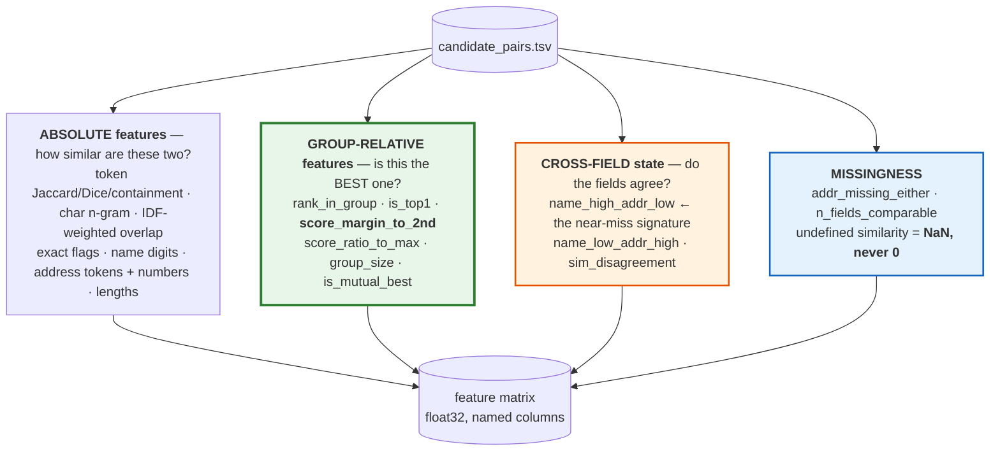
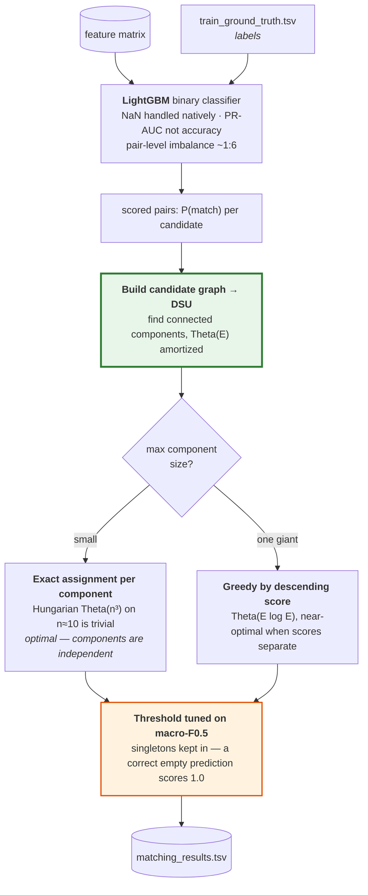
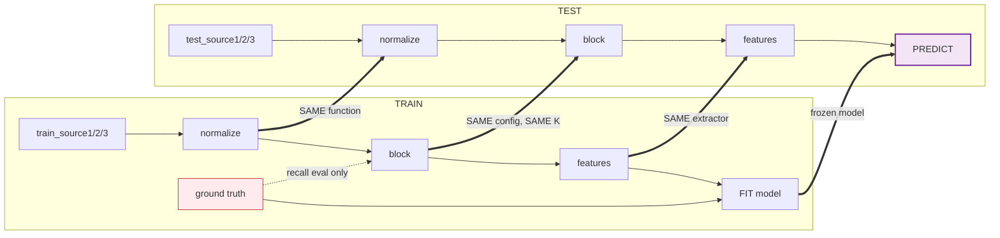
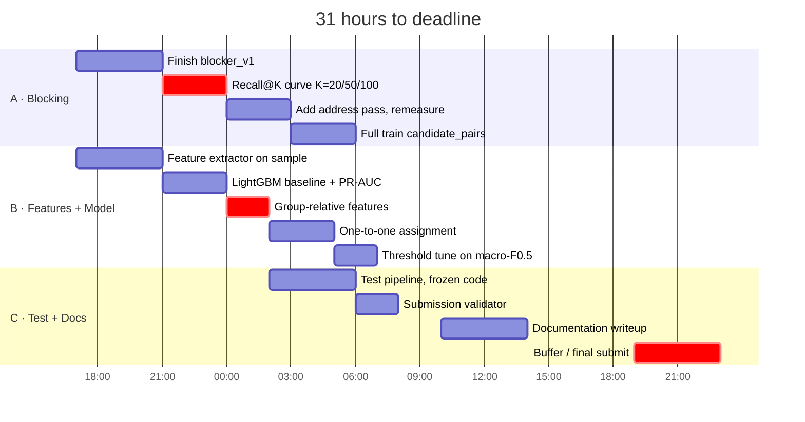

# Amazon ML Challenge 2026 — Business Entity Resolution
## Project Overview & Architecture

| | |
|---|---|
| **Written** | 26 Sep 2026, 16:52 IST |
| **Deadline** | 27 Sep 2026, 23:59 IST — **≈31 hours remaining** |
| **Team** | 3 |
| **Status** | EDA complete · architecture locked · **blocking layer under construction** · matcher not started |
| **Honest state** | No recall number has been measured on the real data yet. That number caps our final score and is the single most important unknown. |

---

## 0. Context — Read This First

> **This section is written to be self-contained.** Anyone — a new teammate or an AI agent — should
> be able to read only §0 and §2 and understand the task, the exact file formats, the scoring rule,
> and what must be delivered. No prior conversation is assumed. All schemas below are copied from the
> official `README.md` and verified against the actual data files.

### 0.1 What Amazon is asking for

Business identity data arrives from **three independent sources**. The same real-world business
appears in several of them under different spellings, abbreviations, transliterations and partial
addresses. **There is no shared identifier between sources.** Deciding which records describe the
same business is the task, and the field's name for it is **Entity Resolution (ER)**, also called
record linkage.

**Source 1 is the deduplicated reference source.** For every Source 1 record, find all matching
records in Source 2 and Source 3. A Source 1 entity may match **zero, one, or many** records.

Direction matters: this is a **one-to-many lookup from S1 into S2 ∪ S3**, not a symmetric
all-pairs deduplication. Nothing is asked about S2↔S3 pairs.

### 0.2 Input files — exact schemas

All files are **tab-separated**. Read with an explicit separator; without it the whole line becomes
one column, silently:

```python
df = pd.read_csv("dataset/train/train_source1.tsv", sep="\t")
```

**The six source files** (`train_source{1,2,3}.tsv`, `test_source{1,2,3}.tsv`) — 4 columns each:

| Column | Description |
|---|---|
| `entity_id` | unique record id. The **prefix tells you the source**: `S1-`, `S2-`, `S3-` |
| `business_name` | may contain abbreviations, legal suffixes, typos, transliterations |
| `business_address` | may be partial, reordered, landmark-based, or missing components |
| `country` | country label. **An open set of strings** — see the warning in §0.6 |

There is **no `source` column.** A record's source is given by its id prefix and by which file it
came from.

Real rows:

```
entity_id	business_name	business_address	country
S1-925783039	Orelee's Barbershop	1795 Westchester Drive, High Point, NC	US
S2-166376419	राम मार्केटिंग प्राइवेट लिमिटेड	KH NO. -570/13, NEW DELHI, WEST DELHI, Delhi	India
S2-764573417	-- Holloway Peak Inc Seafood	105 ELM ST, MORGANTON, NC	US
```

**The ground truth** (`train_ground_truth.tsv`) — **train only, 2 columns**:

| Column | Description |
|---|---|
| `source1_entity_id` | an S1 `entity_id` |
| `matched_entity_ids` | **comma-separated** S2/S3 ids; **empty** when the entity has no matches |

```
source1_entity_id	matched_entity_ids
S1-965667	S2-681193310,S2-743505751,S3-775321672,S3-11291185,S3-860443364
S1-343815751	S2-790675320,S2-479876582,S3-878454467
```

**No ground truth exists for the test set.** Hold out a validation split from training to score
yourself.

### 0.3 Output files — exact schemas, and the format mistake to avoid

Two files, both in an `output/` folder. **Both are wide format: one row per Source 1 entity, with a
comma-separated id list.** They are *not* one row per pair.

**`output/matching_results.tsv`** — the only file scored on the leaderboard:

```
source1_entity_id	matched_entity_ids
S1-00001	S2-00047,S2-00193,S3-00812
S1-00002	S3-00004
S1-00003	
```

**`output/candidate_pairs.tsv`** — same shape, different column name:

```
source1_entity_id	candidate_entity_ids
S1-00001	S2-00047,S2-00193,S3-00812,S3-00999
S1-00002	S3-00004
S1-00003	
```

> **`candidate_pairs.tsv` must be the LAST blocking stage** — the exact set of records your model
> runs inference over, not the raw output of an early pass you later filter. If the pipeline has
> several filtering stages, this file is the final one. Every id in `matching_results.tsv` should
> appear here.

Not scored, but required in the zip; it is used to audit blocking quality (recall ceiling, reduction
ratio) and to verify the pipeline.

**Rules the scorer enforces. Violating any one causes rejection, not a lower score:**

1. **Every** Source 1 entity in `test_source1.tsv` must have **exactly one row**. Missing rows → rejected.
2. Leave the id list **empty** for entities with no matches. An empty list is a valid, scoring answer.
3. **S2-/S3- ids only.** Self-matches to `S1-` ids → rejected.
4. No duplicate ids **within** a list. No duplicate `source1_entity_id` **rows**.
5. Ids must exist in the test set.
6. **Tab-separated, UTF-8.** Writing a CSV is the single most common failure — the validator checks
   for it specifically. Use `df.to_csv(path, sep="\t", index=False, encoding="utf-8")`.

Validate locally before every submission:

```bash
python3 utils/validate_submission.py \
    --matching output/matching_results.tsv \
    --candidate output/candidate_pairs.tsv \
    --test-dir dataset/test
```

`PASS` (exit 0) means safe to submit. It never computes your score and never reads ground truth.

### 0.4 The scoring rule, with worked arithmetic

**Macro-averaged F₀.₅.** Computed **per Source 1 entity**, then averaged over **all** S1 entities.

```
F0.5 = (1.25 × Precision × Recall) / (0.25 × Precision + Recall)
```

Per entity: `TP` = predicted ids that are correct, `FP` = predicted but wrong, `FN` = true but missed.

**Why precision dominates** — same entity, truth = `{S2-1, S3-1}`:

| Prediction | TP | FP | FN | P | R | **F₀.₅** |
|---|---|---|---|---|---|---|
| `{S2-1, S3-1}` — both correct | 2 | 0 | 0 | 1.000 | 1.000 | **1.0000** |
| `{S2-1}` — **precise but incomplete** | 1 | 0 | 1 | 1.000 | 0.500 | **0.8333** |
| `{S2-1, S3-1, S3-9}` — **complete but one wrong** | 2 | 1 | 0 | 0.667 | 1.000 | **0.7143** |
| `{S2-1, S3-9}` — one right, one wrong | 1 | 1 | 1 | 0.500 | 0.500 | **0.5000** |

**Read row 2 against row 3.** Finding only one of two matches scores **0.833**. Finding both but
adding one false match scores **0.714**. *Under-predicting beats over-predicting.* This single
comparison should govern every threshold decision.

**Singletons are in the average:**
- true matches = `{}`, predicted = `{}` → **1.0**. Free points.
- true matches = `{}`, predicted = anything → **0.0**.

5.58% of training entities are singletons. Never force a prediction.

### 0.5 What must be delivered

A single zip, in addition to live leaderboard uploads:

```
<team_name>_submission.zip
├── output/
│   ├── matching_results.tsv        # scored on the leaderboard
│   └── candidate_pairs.tsv         # blocking candidate set (audited, not scored)
├── code/
│   └── business_entity_resolution/
│       ├── src/                    # all source code
│       ├── README.md               # exact end-to-end reproduction steps
│       └── requirements.txt        # pinned dependencies
└── Documentation_template.md       # filled-in methodology write-up
```

**Anyone must be able to regenerate both output files from the data using only what is in that
folder.** Top teams' packages are reviewed in detail before final rankings are confirmed.

`Documentation_template.md` asks for: executive summary · EDA insights · solution strategy ·
blocking keys and candidate count · **how you ensured true matches were not lost** · features used ·
model type · threshold selection method · **macro F₀.₅ score** · common false positives · common
false negatives · conclusion · code-artefact summary.

### 0.6 Constraints — violations are disqualifying

1. **No external databases, APIs, or services to look up business identities or resolve entities.**
   This includes geocoding APIs and any internet-based data augmentation. Every signal must derive
   from the four provided columns.
2. Final model must be **MIT or Apache-2.0 licensed** and **≤8 billion parameters**.
3. Output format exactly as specified. Failed validation is not evaluated at all.
4. Every Source 1 test entity must appear. No duplicate ids in a list, no duplicate rows.
5. The **private leaderboard decides final rankings.** Do not tune against the public score.

> **⚠ `country` is an OPEN SET.** Training covers `US` and `India`. The test set additionally
> contains **`France`**, absent from training. The official README explicitly warns: do **not**
> hard-code, filter, or one-hot the pipeline to `{US, India}`. Partitioning by country is
> sound — but partition over the **labels observed at runtime**, never a hard-coded list, and every
> test entity including French ones must appear in the submission.

### 0.7 Vocabulary — used consistently throughout this document

| Term | Meaning here |
|---|---|
| **S1 / S2 / S3** | Source 1 / 2 / 3. S1 is the deduplicated reference side; S2 and S3 are searched |
| **Entity / record** | one row in a source file, identified by `entity_id` |
| **Pair** | one (S1 record, S2-or-S3 record) combination being considered |
| **Candidate** | an S2/S3 record that blocking proposed for a given S1 record |
| **Blocking / candidate generation** | cheaply reducing 2.28e13 possible pairs to ~1e8 plausible ones |
| **Matcher** | the model that scores each candidate pair and decides which to keep |
| **Pair completeness (PC) / candidate recall** | fraction of true pairs present in the candidate set. **A hard upper bound on the final score** |
| **Recall@K** | PC as a function of candidates retrieved per S1 record |
| **Hard negative** | a non-match that looks like a match. What the matcher must learn to reject |
| **Singleton** | an S1 entity with zero true matches. Correctly predicting empty scores 1.0 |
| **Long vs wide format** | internal working files are long (one row per pair); **submission files are wide** (one row per S1 entity) |

### 0.8 If you are an AI agent picking this project up

**Do:**
- Read `eda/FINDINGS.md` next — it holds the measured facts. **Measured data overrides any heuristic**, including anything asserted here.
- Read `PROJECT_CONTEXT.md` for the design constraints already derived from those facts.
- Use the project venv: `/home/yash/dev/clg/amlc-2026/.venv/bin/python`.
- Read every TSV with `sep="\t"`.
- Normalize text by stripping punctuation **by Unicode category**, never with `[^\w\s]` — see finding #4; that regex silently destroys Devanagari.
- Keep working files long-format; **convert to wide only when writing the two submission files.**

**Do not:**
- Use ground truth to filter, augment, or reorder `candidate_pairs.tsv`. It is an evaluation signal only. Every generated candidate, including wrong ones, must reach the matcher — hard negatives are its training signal.
- Fetch any external data, call any API, or geocode. Disqualifying.
- Hard-code the country list.
- Assume `candidate_pairs.tsv` is long-format. It is wide. Getting this wrong means rejection.
- Trust any performance claim in this document that is not accompanied by a number and a source.

**Specialist agents are available** for the three pipeline stages:
`candidate-generation-research-architect` (blocking), `dsa-algorithm-engineering-architect`
(complexity, memory, throughput), `feature-engineering-matching-architect` (pairwise features).
Their knowledge bases are in `~/.claude/skills/{candidate-generation,algorithm-engineering,pairwise-features}/`.

---

## 1. The Problem (summary — full detail in §0)

For every record in **Source 1**, find all records in **Source 2** and **Source 3** that describe the
same real-world business.

**Fields available — all four, nothing else:** `entity_id`, `business_name`, `business_address`, `country`.
Tab-separated.

### Scale

| File | Rows |
|---|---|
| `train_source1` | 2,206,821 |
| `train_source2` | 5,034,616 |
| `train_source3` | 5,285,603 |
| `test_source1` | 1,732,544 |
| `test_source2` | 4,887,273 |
| `test_source3` | 5,082,316 |

Ground truth: **7,638,365** matched pairs over 2,206,821 S1 entities.

### What the metric implies for design

Full definition and worked arithmetic in **§0.4**. The two consequences we design around:

1. **Precision is weighted 2× recall.** Finding 1 of 2 matches scores **0.833**; finding both plus
   one false match scores **0.714**. **Under-predicting beats over-predicting** — that governs every
   threshold decision.
2. **Singletons are free points.** 5.58% of entities have no match; predicting empty scores 1.0.
   Never force a prediction.

---

## 2. Architecture

> This section is the important one. Everything else is detail.

### 2.1 The pipeline, top level

Four stages. Each has a **hard contract** at its boundary — that is what lets three people work in
parallel without blocking each other.



### 2.2 The contracts — memorize these

| Boundary | Schema | Owner | Consumer must assume |
|---|---|---|---|
| after normalization | `name_norm`, `name_core`, `tokens`, `ngrams`, `addr_*`, `script` | shared | keys are **additive** — original is never destroyed |
| candidates, **internal** | long format: `s1_id · cand_id · source · score · pass` | Stage 1 | rows are **unfiltered by labels**; negatives are present on purpose |
| `output/candidate_pairs.tsv`, **submitted** | **wide**: `source1_entity_id · candidate_entity_ids` (comma-separated) | Stage 1 | one row per S1 entity, empty allowed. **Must be the LAST blocking stage** — what the model actually scores |
| feature matrix | `s1_id · cand_id` + ~40 named float32 columns | Stage 2 | **NaN means undefined**, not "no similarity" |
| `output/matching_results.tsv` | **wide**: `source1_entity_id · matched_entity_ids` (comma-separated) | Stage 3 | one row per test S1 entity, **no exceptions**; an empty list is a valid, scoring answer |

**Two rules that cross every boundary:**

1. **Ground truth evaluates; it never generates.** Stage 1 must produce a byte-identical
   `candidate_pairs.tsv` with the ground-truth file deleted. Every candidate — including the wrong
   ones — reaches the matcher, because hard negatives are what teach it to reject.
2. **Train and test run the same frozen code.** One normalization function, one extractor, one
   retrieval config. Not two implementations that "do the same thing" — those drift, and the drift
   appears as a validation score that does not survive the real test set.

### 2.3 Stage 1 internals — the partitioned union



**Why each pass exists** — if a pass cannot answer this, it gets deleted:

| Pass | Recovers | Marginal cost |
|---|---|---|
| 1 exact | ~22% of pairs at near-zero cost, and removes them from the expensive passes | ~0 |
| 2 name TF-IDF | the bulk of recall — typos, word order, abbreviation | dominant |
| 3 **address** | the **14.81%** of true pairs sharing *no* name token. **Omitting this silently forfeits 15% of achievable recall** | moderate |
| 4 transliteration | the 4.17% cross-script pairs, invisible to every lexical metric | small (gated) |

**Union recall is monotone** — adding a pass can only help. So passes are engineered to be
*complementary*, not individually excellent. Keep or cut each by its **marginal** recall:
`PC(all) − PC(all − pass_i)`, never its standalone number.

### 2.4 Stage 2 internals — why absolute similarity is not enough



**The problem group-relative features solve.** 39.2% of S1 rows share a normalized name —
`primary care group` appears **253 times**. So:

```
S1: primary care group, 9 Oak Road, Boston
FP: primary care group, 500 Pine St, Chicago      name_similarity = 1.00
```

Name similarity is *perfect* and the pair is *wrong*. Fifty candidates tie. A sixth string metric
returns 1.00 too and adds nothing — **the problem is not that similarity is low, it is that
similarity is ambiguous.**

What separates them is position in the candidate group. Two pairs both scoring 0.97:

| | score | margin to runner-up | reading |
|---|---|---|---|
| pair A | 0.97 | **0.350** | clear winner |
| pair B | 0.97 | **0.010** | coin flip |

Absolute similarity is identical. `score_margin_to_2nd` separates them, and it costs Θ(P log P) —
seconds over the whole set. **Best value-to-cost ratio in the entire feature set, and most teams
never compute it.**

### 2.5 Stage 3 internals — exploiting the one-to-one structure



**The exploit.** Ground truth is a **partition**: 7,638,365 matched slots, 7,638,365 distinct ids,
**zero reuse**. No S2/S3 record is ever claimed by two different S1 entities.

So when two S1 entities both claim one record, **at most one is right** — drop the loser by score.
That is pure precision gain, which F₀.₅ rewards double. Most teams will score pairs independently
and miss this entirely.

Global Hungarian assignment is Θ(n³) — at n=2.2e6 that is ~1e19 operations, impossible. But the
optimal assignment **decomposes exactly along connected components**, because no candidate edge
crosses them. So: DSU to find components, then exact assignment per component. Cheap *and* optimal —
provided the graph shatters. **Measure `max(component_size)` before committing.**

### 2.6 Train / test symmetry



**The failure this prevents.** Group-relative features depend on how the candidate group was formed.
Train with K=50 and test with K=100 and `rank_in_group`, `group_size`, and every normalized variant
shift distribution — no label was touched, so no leakage check flags it, and the model quietly
degrades. **K is frozen. So is `min_df`, the analyzer, and the normalizer.**

---

## 3. The 10 Findings That Drive Everything

All measured from `eda/FINDINGS.md` and the 18-figure notebook. These are our actual edge.

| # | Finding | Exploit |
|---|---|---|
| **1** | **Matching is one-to-one.** 7,638,365 slots → 7,638,365 distinct ids, zero reuse | Solve as global assignment, not independent pairs. Pure precision gain |
| **2** | **Matches never cross country.** 0 of 138,120 sampled pairs | Partition by country: free 3× reduction, bounded memory, and France (absent from train) becomes its own partition instead of distribution shift. **Partition over labels observed at runtime — `country` is an open set and hard-coding `{US, India}` is explicitly forbidden** |
| **3** | **Name-only blocking caps at ~85%.** 14.81% of true pairs share no name token — and **96.3% of those have address Jaccard > 0.2** | Blocking **must** union a name blocker AND an address blocker |
| **4** | **`[^\w\s]` destroys Devanagari.** Vowel signs and virama are Unicode `Mn`/`Mc`, which `\w` does not match — words shatter into consonants, silently | Strip by Unicode category. Affects 5.35% of S2, 2.99% of S3 |
| **5** | **39.2% of S1 rows share a normalized name.** `primary care group` ×253 | Name similarity alone cannot decide. Address must break ties, and group-relative features are mandatory |
| **6** | **Token frequency is extremely skewed.** `com` 4.0% of rows, `group` 2.8%; 640,329 tokens appear once | IDF-weight, never a hard df cap (see the negative result below) |
| **7** | **Data is clean.** No nulls, no dup ids, no malformed rows | The difficulty is scale + ambiguity, not dirtiness. Don't spend time on cleaning |
| **8** | **~3.3% of S2/S3 have empty address** | Name-only fallback required; similarity must be NaN, not 0 |
| **9** | **4.17% of true pairs are cross-script** (S1 is 100% ASCII) | Transliteration as an *additional* key. But 4.17% is small — measure before investing days |
| **10** | **`country_match` has variance 0** once blocking partitions on country | Drop it as a feature. It is a blocking rule, not evidence |

### Negative result — do not repeat

A rare-token blocker (`df ≤ 120`) + address-numeric keys measured **45.53% recall at K=40** — far
below the 85% token-sharing ceiling. **Cause:** the hard `df` cut discards common tokens that were
the *only* shared signal for many pairs. **Fix is IDF weighting over all tokens, not a different
threshold.**

---

## 4. Inventory — what exists right now

### Done

| Artifact | Path |
|---|---|
| EDA notebook, 34 cells, 18 figures, zero errors | `eda/EDA_entity_resolution.ipynb` / `.html` |
| Findings report | `eda/FINDINGS.md` |
| Pair feature matrix (520,795 × 20) for analysis | `eda/pairs.csv` |
| Architecture diagram (177 elements) | `diagram/entity-matching-pipeline.excalidraw` |
| Mermaid diagrams, 7 files rendered | `diagram/mermaid/` |
| Project context / design constraints | `PROJECT_CONTEXT.md` |
| 3 specialist agents + knowledge bases (7,004 lines) | `~/.claude/agents/`, `~/.claude/skills/` |

### In progress

| Layer | Path | State |
|---|---|---|
| **Blocking / candidate generation** | `blocking/` | Under active construction — `normalize.py`, `index.py`, `blocker_v1.py`, `measure_recall_at_k.py`, `smoke_test.py` |

### Not started

- Pairwise feature extraction over real candidates
- LightGBM matcher
- Global one-to-one assignment
- Threshold tuning on macro-F₀.₅
- Test-set run and submission
- `Documentation_template.md` writeup (required deliverable)

### The gap, stated plainly

**We have no measured recall number on real data.** Every downstream estimate rests on the blocking
ceiling, and the ceiling is unverified. Until `measure_recall_at_k.py` produces a curve, our expected
score is a guess.

---

## 5. The Numbers That Constrain Design

| Quantity | Value | Consequence |
|---|---|---|
| Brute-force pairs | 2.2e6 × 1.03e7 = **2.28e13** | ≈**26 days** at 1e7 pairs/s. Indexing is not optional |
| Candidate budget at K=50 | **1.1e8 pairs** | the number every later cost multiplies |
| Inverted index, flat int32 postings | **1.96 GB** | fits 14 GB comfortably |
| Same index as dict-of-lists | **16.8 GB** | **does not fit.** Layout alone decides feasibility |
| TF-IDF CSR, 12.5M × 40 nnz | **3.77 GB** | fits; partition by country for headroom |
| Feature matrix, 1.1e8 × 40 float32 | **17.6 GB** | **must chunk to disk.** float32 not float64 |
| Top-50 of 2e6 scores | argsort 74 ms vs **argpartition 8.4 ms** | 8.8× — and it runs 2.2M times |
| Feature extraction, ~17 µs/pair | ~28 min serial, **~6 min at `workers=-1`** | affordable; the expensive tier is not |

---

## 6. Work Split — 31 Hours, 3 People

The contracts in §2.2 make these three tracks genuinely parallel.



| Track | Owner | Deliverable | Depends on |
|---|---|---|---|
| **A — Blocking** | 1 | `candidate_pairs.tsv` + recall@K curve | nothing (unblocked now) |
| **B — Features + Matcher** | 1 | scored pairs + assignment | a *sample* of candidate pairs (not the full run) |
| **C — Test run + Docs** | 1 | submission + required writeup | frozen code from A and B |

**Unblock B immediately:** Track A should emit a **1% sample** of `candidate_pairs.tsv` within the
first two hours so Track B can build the extractor and matcher against real data instead of waiting
for the full run.

### The two critical-path items

1. **Recall@K curve** (Track A). It caps the final score and everything downstream is estimated
   against it. Get it first.
2. **Group-relative features** (Track B). Cheapest large gain available, and the thing that addresses
   finding #5, which is our hardest problem.

---

## 7. Risks

| # | Risk | Impact | Mitigation |
|---|---|---|---|
| 1 | **Blocking recall lands well below 85%** | hard ceiling on score | Measure early. Fix with IDF weighting + the address pass, not a bigger K |
| 2 | **Nothing end-to-end by deadline** | no submission at all | **Build a working thin pipeline first**, even at poor accuracy. A weak submission beats none |
| 3 | Feature matrix exceeds RAM | pipeline dies late | Chunk to disk from the start; partition by country |
| 4 | Train/test code drift | validation score does not survive test | One frozen function per stage; assert output schemas match |
| 5 | Candidate graph fails to shatter (one giant DSU component) | exact assignment infeasible | Greedy-by-score fallback, already specified |
| 6 | Overfitting the public leaderboard | private LB decides final rank | Tune on a held-out split, not the public score |
| 7 | Time lost to the 4.17% cross-script slice | opportunity cost | Measure the subgroup first; accepting the loss is a legitimate call |
| 8 | Disk/memory pressure | job failures | 1 GB dataset zip in `~/Downloads` can be deleted; extracted copy is what matters |

---

## 8. Compliance

**Full rules with exact wording: §0.6.** The four that most easily cost us everything:

| | Rule | Failure mode |
|---|---|---|
| 1 | **No external data, APIs, or geocoding.** Every signal from the four provided columns | disqualification |
| 2 | **Wide output format, tab-separated, UTF-8.** One row per test S1 entity, no exceptions | submission not evaluated |
| 3 | **`country` is an open set** — never hard-code `{US, India}`; France is test-only | broken pipeline + missing rows |
| 4 | Model MIT/Apache-2.0, ≤8B parameters. **Private leaderboard decides rankings** | disqualification / overfit public LB |

Run `utils/validate_submission.py` before every upload. It catches rule 2 locally instead of costing
a submission.

---

## Appendix A — File Map

```
~/dev/clg/amlc-2026/
├── PROJECT_OVERVIEW.md          ← this file
├── PROJECT_CONTEXT.md           design constraints for the agents
├── blocking/                    Stage 1 (IN PROGRESS)
│   ├── normalize.py  index.py  blocker_v1.py
│   ├── measure.py  measure_recall_at_k.py  smoke_test.py
│   └── config.py  io_utils.py
├── eda/
│   ├── FINDINGS.md              ← read this second
│   ├── EDA_entity_resolution.ipynb / .html
│   ├── pairs.csv                520,795 × 20 analysis matrix
│   ├── figures/                 18 plots
│   └── phase_a/b/c_*.py  build_pair_matrix.py
├── diagram/
│   ├── entity-matching-pipeline.excalidraw
│   └── mermaid/                 7 .mmd + .svg + .png
└── subagents/                   curated source collections (3 syllabi)

~/Downloads/Amazon-ML-dataset/student_resource/
├── dataset/train/  train_source{1,2,3}.tsv  train_ground_truth.tsv
├── dataset/test/   test_source{1,2,3}.tsv
└── utils/validate_submission.py
```

## Appendix B — Commands

Read TSVs with `sep="\t"`. Use the project venv:

```bash
/home/yash/dev/clg/amlc-2026/.venv/bin/python
```

Render a Mermaid diagram from this file's code blocks:

```bash
npx mmdc -i diagram.mmd -o diagram.svg -c diagram/mermaid/mermaid-config.json -b white
```

## Appendix C — Glossary

| Term | Meaning |
|---|---|
| **Blocking / candidate generation** | cheaply narrowing 2.3e13 possible pairs to ~1e8 plausible ones |
| **Pair completeness (PC)** | candidate recall — the fraction of true pairs present in `candidate_pairs.tsv`. **Upper bound on every downstream score** |
| **Recall@K** | PC as a function of candidates retrieved per record. The central diagnostic |
| **Marginal recall** | `PC(all passes) − PC(all − pass_i)`. The only honest way to judge a blocking pass |
| **Hard negative** | a non-match that looks like a match. What the matcher must learn to reject |
| **Group-relative feature** | describes a pair's position within its candidate group, not its absolute similarity |
| **DSU** | disjoint-set union / union-find. Finds connected components in ~Θ(1) amortized per edge |
| **IDF** | inverse document frequency. Down-weights common tokens, up-weights rare, discriminative ones |
